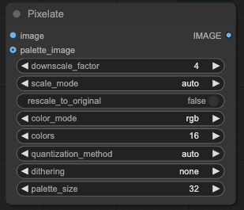

# ComfyUIPixelate

[sd-webui-pixelart](https://github.com/mrreplicart/sd-webui-pixelart) are referenced by many webui users, this node is mean to use it in ComfyUI.

  
  
## Features

- **Downscaling Options**: Multiple high-quality scaling algorithms:
  - `auto`: Automatically selects the best method
  - `nearest`: Best for preserving exact colors
  - `area`: Optimal for general downscaling
  - `linear`: Smooth transitions but may blur
  - `cubic`: Sharper edges than linear
  - `lanczos`: High quality with edge preservation

- **Color Processing**:
  - RGB color mode
  - Grayscale conversion
  - Binary (Black & White) conversion

- **Advanced Color Quantization**:
  - Multiple palette generation methods:
    - `auto`: Smart method selection based on image size and color count
    - `libimagequant`: High-quality quantization
    - `kmeans`: GPU-accelerated when available (falls back to CPU)
    - `mediancut`: Fast with good quality
    - `maxcoverage`: Better color distribution
    - `fastoctree`: Fastest option for large images
    - `median_cut`: Custom implementation

- **Dithering Support**:
  - Floyd-Steinberg dithering for smooth color transitions
  - Simple quantization for clean, sharp results

- **Custom Palette Support**:
  - Use reference images to extract palettes
  - Control palette size (2-256 colors)

## Usage

1. Add the "Pixelate" node to your ComfyUI workflow
2. Connect an image input
3. Configure parameters:
   - `downscale_factor`: How much to reduce the image (1-32)
   - `scale_mode`: Choose scaling algorithm
   - `rescale_to_original`: Option to restore original size
   - `color_mode`: RGB/Grayscale/BW
   - `colors`: Number of colors in output (2-256)
   - `quantization_method`: Palette generation method
   - `dithering`: None or Floyd-Steinberg
   - Optional: Connect a palette reference image

## Performance Considerations

- The node automatically selects optimal methods based on image size:
  - Large images (>1M pixels) or many colors (>32): Uses fast octree
  - Medium images (>500K pixels): Uses libimagequant
  - Small images: Uses k-means clustering
- GPU acceleration for k-means when available
- Caching for color quantization to improve speed

## Credits

- Original concept based on [sd-webui-pixelart](https://github.com/mrreplicart/sd-webui-pixelart)